<h1 align="center">The Third Space</h1>

  <b>A social event-discovery app — designed and built end to end.</b> 
  Figma → React Native → shipped at <a href="https://thethirdspaceapp.com">thethirdspaceapp.com</a>

  <a href="https://thethirdspaceapp.com"><b>Live app</b></a>

<!-- ─────────────────────────────────────────────────────────────
     The app's source repo (TheThirdSpaceApp) is currently private,
     so it is deliberately not linked here — a 404 in a portfolio
     piece reads worse than no link. If you make it public, add:
       · <a href="https://github.com/bm-Yassine/TheThirdSpaceApp"><b>Source code</b></a>
     ───────────────────────────────────────────────────────────── -->

---

## Discovery — three ways to decide

<table>
<tr>
<td width="33%">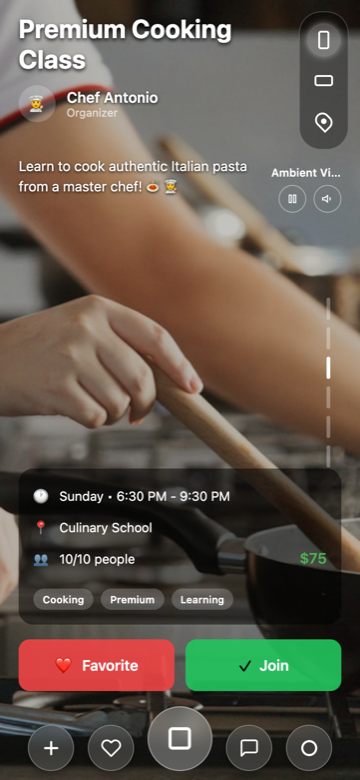</td>
<td width="33%">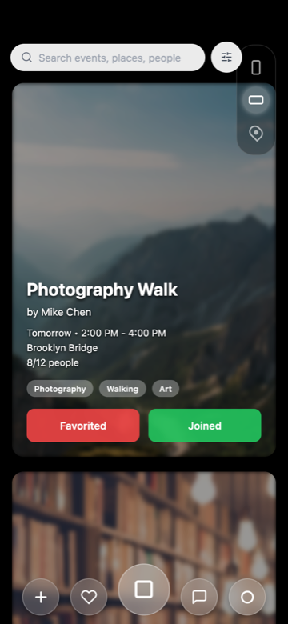</td>
<td width="33%">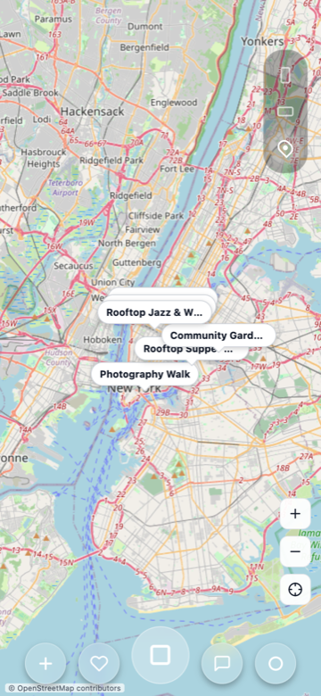</td>
</tr>
<tr>
<td align="center"><b>Discover</b> "Show me something I'll want to do"</td>
<td align="center"><b>Cards</b> "What are my options?"</td>
<td align="center"><b>Map</b> "What's near me?"</td>
</tr>
</table>

<!-- ─────────────────────────────────────────────────────────────
     YOUR WORDS: why three views instead of one list?
     A short paragraph in your voice goes further than anything
     I could infer. Delete this comment when you've written it.
     ───────────────────────────────────────────────────────────── -->

---

## Committing to an event

<table>
<tr>
<td width="33%">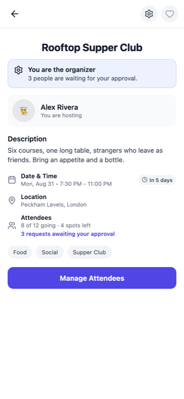</td>
<td width="33%">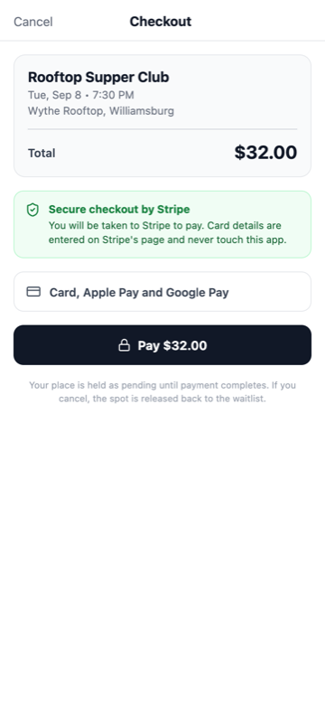</td>
<td width="33%">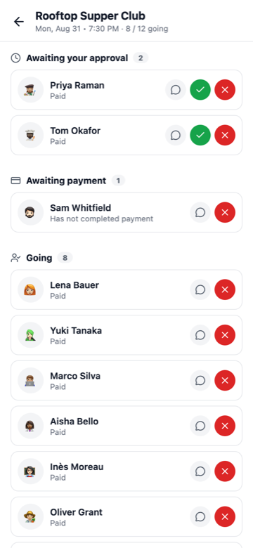</td>
</tr>
<tr>
<td align="center"><b>Event detail</b> State-aware call to action</td>
<td align="center"><b>Checkout</b> Stripe, price fixed server-side</td>
<td align="center"><b>Manage attendees</b> Approvals, payment, waitlist</td>
</tr>
</table>

Joining isn't one action. The button names the state you're actually in:

| | |
|---|---|
| **Join Event** | Free, open, space available |
| **Request to Join** | Organizer approves you |
| **Join · $32** | Payment first |
| **Join Waitlist** | Full — you're promoted automatically |

<!-- ─────────────────────────────────────────────────────────────
     YOUR WORDS: the thinking behind the four commitment states.
     What made you split them out rather than ship one "Join"?
     ───────────────────────────────────────────────────────────── -->

---

## Creating and organizing

<table>
<tr>
<td width="33%">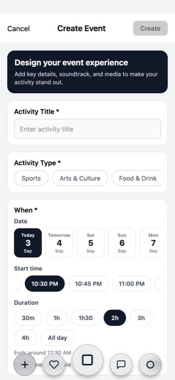</td>
<td width="33%">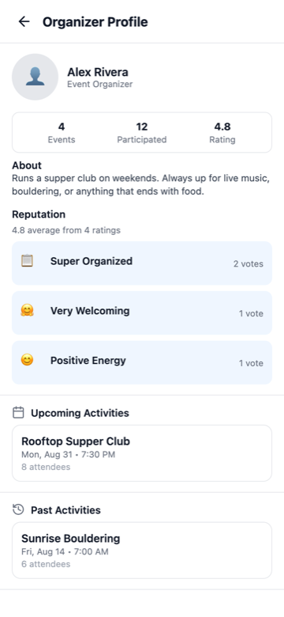</td>
<td width="33%">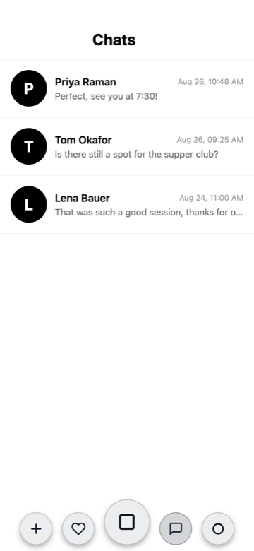</td>
</tr>
<tr>
<td align="center"><b>Create</b> Date, time, duration in three taps</td>
<td align="center"><b>Organizer profile</b> Reputation from real ratings</td>
<td align="center"><b>Messages</b> Realtime, 1:1</td>
</tr>
</table>

<!-- ─────────────────────────────────────────────────────────────
     YOUR WORDS: anything about the event creation flow —
     what you cut, what you fought to keep.
     ───────────────────────────────────────────────────────────── -->

---

## Reputation and history

<table>
<tr>
<td width="33%">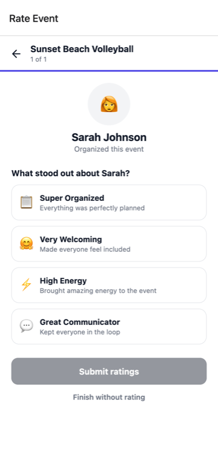</td>
<td width="33%">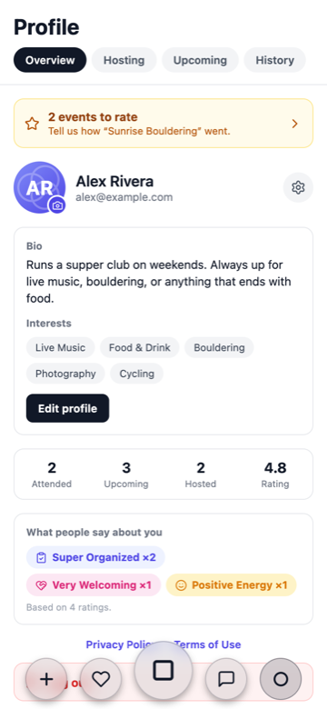</td>
<td width="33%">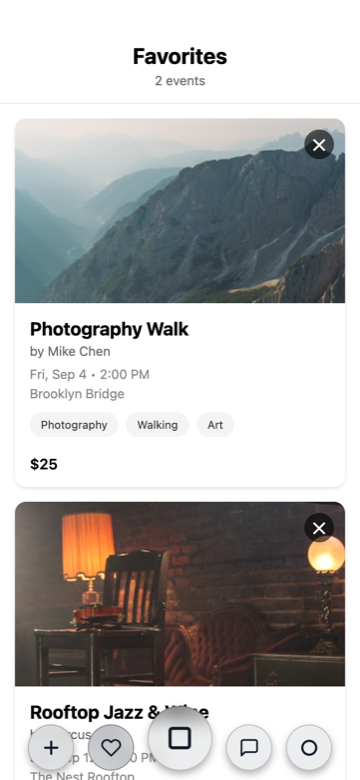</td>
</tr>
<tr>
<td align="center"><b>Rate</b> Qualities, not just stars</td>
<td align="center"><b>Profile</b> Hosting · Upcoming · History</td>
<td align="center"><b>Favourites</b> Saved for later</td>
</tr>
</table>

Ratings are qualitative first — **Super Organized 📋**, **Very Welcoming 🤗**, **High Energy ⚡** — so reputation reads as *"Super Organized ×15"* rather than an averaged number. Organizers rate attendees on a different set, because hosting well and attending well are different skills.

<!-- ─────────────────────────────────────────────────────────────
     YOUR WORDS: why qualities over a 5-star average.
     ───────────────────────────────────────────────────────────── -->

---

## Identity system

Everyone used to render the same 👤 glyph, and rating qualities were emoji —
which look different on every platform, cannot be tinted, and read as
decoration rather than as part of a product.

**Avatars.** A photo when someone uploads one. Otherwise a generated avatar
derived from their user id: a gradient from a curated palette, their initials,
and the three-circle mark ghosted behind. It is deterministic, so the same
person looks the same on every screen and every device, and the mark is what
makes it feel like *this* app rather than a generic initials bubble.

**Quality icons.** The badges people award each other — Super Organized, Very
Welcoming, High Energy — are line glyphs in tinted tiles, drawn from the same
icon family as the rest of the interface. Each quality has one definition
shared between the screen where you award it and every place it is later
displayed, so a badge can never drift out of sync with itself.

---

## Design system

<table>
<tr><th align="left">Role</th><th align="left">Value</th><th align="left">Used for</th></tr>
<tr><td>Ink</td><td><code>#111827</code></td><td>Text, primary buttons, Discover ground</td></tr>
<tr><td>Accent</td><td><code>#6366F1</code></td><td>Brand, sign-in, loading</td></tr>
<tr><td>Accent deep</td><td><code>#4F46E5</code></td><td>Organizer actions, selected state</td></tr>
<tr><td>Body</td><td><code>#374151</code></td><td>Body copy</td></tr>
<tr><td>Muted</td><td><code>#6B7280</code></td><td>Secondary text, icons</td></tr>
<tr><td>Hairline</td><td><code>#E5E7EB</code></td><td>Borders, dividers</td></tr>
<tr><td>Surface</td><td><code>#F3F4F6</code></td><td>Chips, ghost buttons</td></tr>
</table>

**Status colours** mean the same thing on every screen:

<table>
<tr><th align="left">State</th><th align="left">Fill / Border</th><th align="left">Meaning</th></tr>
<tr><td>Confirmed</td><td><code>#DCFCE7</code> / <code>#BBF7D0</code></td><td>You have a place</td></tr>
<tr><td>Pending</td><td><code>#EFF6FF</code> / <code>#BFDBFE</code></td><td>Waiting on someone else</td></tr>
<tr><td>Attention</td><td><code>#FFEDD5</code> / <code>#FED7AA</code></td><td>Waitlist, payment due</td></tr>
<tr><td>Declined</td><td><code>#FEF2F2</code> / <code>#FECACA</code></td><td>Not happening</td></tr>
<tr><td>Organizer</td><td><code>#EEF2FF</code> / <code>#C7D2FE</code></td><td>You run this</td></tr>
</table>

**Type** — system font throughout (SF / Roboto / system-ui). Screen title 26·700 · Event title 22·700 · Section 15·700 · Body 14·400 · Meta 12–13 · Micro 11·600

**Shape** — radius 999 (pills, avatars, nav) · 14 (feature cards) · 12 (buttons, banners) · 8 (inputs)

**Rhythm** — 4pt base, 16pt screen gutter, 36–44pt touch targets

Machine-readable: [`design-system/tokens.json`](design-system/tokens.json)

---

## Wireframe → shipped

The concept began as a scrollable Figma Make wireframe. What changed on the way to a real product:

| Wireframe | Shipped |
|---|---|
| Hardcoded "Tomorrow · 2:00 PM - 4:00 PM" | Computed from a real timestamp |
| Favorite and Join equally weighted | Join primary, Favorite secondary |
| One "Join" action | Four labelled commitment states |
| Music as a static chip | Track metadata with scrolling marquee |

<!-- ─────────────────────────────────────────────────────────────
     YOUR WORDS: the honest version of what the wireframe got
     wrong, and what you only learned by building it.
     ───────────────────────────────────────────────────────────── -->

---

Design and development by <b>Yassine</b> · <a href="https://github.com/bm-Yassine">@bm-Yassine</a> 
Built for a client and published with their permission. Screens captured from the running app at 390×844.
